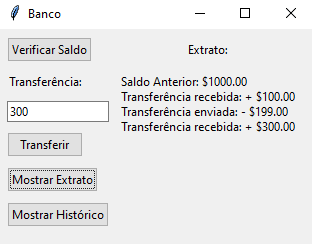
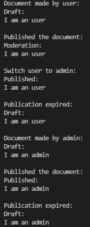

# Behaviours Design Patterns

# Bank

Created a simple Bank GUI for a client using tkinter and the command design pattern. Here is a printscreen from the user interface showing the extract.

# Document

Created a finite state machine with states of a document and printed the document before and after each transition:

