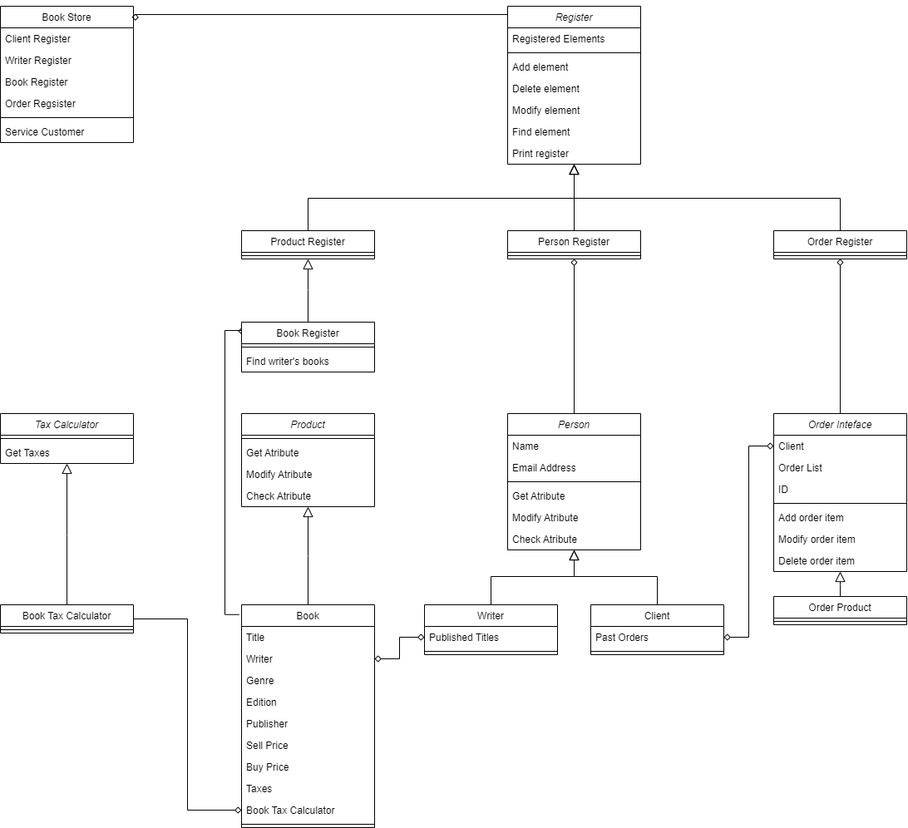
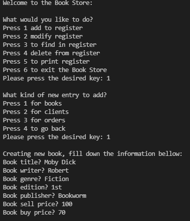

# Book Store
## Design Choices
Book Store prototype implementation by Eric Guerra for the CES-22 Course. The idea was to create abstract classes as interfaces and then use them via inheritance. This allows ease of change by mantaining the interfaces and expanding the classes not to break compatibility. For example, a generic Tax Calculator was modeled, and for each type of product, a specific Tax Calculator is used. This applies the open closed principle, for instance.

For the user interface, ```print```s and ```input```s were used for, allowing the user to control the program via reading and typing the terminal. This was used as it is fairly simple to implement and to use, suitable for a simple prototype.


## Classes
The Class Diagram of the Book Store model can be seen bellow.



Those classes are distributed in the following files.
- ```product.py```: Product class and its children (Book).
- ```taxes.py```: Tax Calculator class and its children (Book Tax Calculator).
- ```person.py```: Person class and its children (Client and Writer).
- ```order.py```: Order Inteface class and its children (Product Order).
- ```register.py```: Register class and its children (Person Register, Product Register, Book Register, Order Register).
- ```bookstore.py```: Book store class.
- ```main.py```: Main file, runs the program.

## Execution
The program can be executed by running the ```main.py``` file. In the image bellow, the execution can be seen in a print screen. To test it, in ```sample_input.txt``` there is a sample input.



Here is the full execution of the sample input:
```
Welcome to the Book Store:

What would you like to do?    
Press 1 add to register       
Press 2 modify register       
Press 3 to find in register   
Press 4 delete from register  
Press 5 to print register     
Press 6 to exit the Book Store
Please press the desired key: 1

What kind of new entry to add?
Press 1 for books
Press 2 for clients
Press 3 for orders
Press 4 to go back
Please press the desired key: 1

Creating new book, fill down the information bellow:
Book title? Moby Dick
Book writer? Robert
Book genre? Fiction
Book edition? 1st
Book publisher? Bookworm
Book sell price? 100
Book buy price? 70

What would you like to do?
Press 1 add to register
Press 2 modify register
Press 3 to find in register
Press 4 delete from register
Press 5 to print register
Press 6 to exit the Book Store
Please press the desired key: 3

What kind of entry to find?
Press 1 for books by title
Press 2 for books by writer
Press 3 for clients
Press 4 for orders
Press 5 to go back
Please press the desired key: 2

What's the writer name? Robert
[Moby Dick]

What would you like to do?
Press 1 add to register
Press 2 modify register
Press 3 to find in register
Press 4 delete from register
Press 5 to print register
Press 6 to exit the Book Store
Please press the desired key: 1

What kind of new entry to add?
Press 1 for books
Press 2 for clients
Press 3 for orders
Press 4 to go back
Please press the desired key: 1

Creating new book, fill down the information bellow:
Book title? Coding 101
Book writer? Robert
Book genre? Educational
Book edition? 1st
Book publisher? Cengage
Book sell price? 60
Book buy price? 30

What would you like to do?
Press 1 add to register
Press 2 modify register
Press 3 to find in register
Press 4 delete from register
Press 5 to print register
Press 6 to exit the Book Store
Please press the desired key: 3

What kind of entry to find?
Press 1 for books by title
Press 2 for books by writer
Press 3 for clients
Press 4 for orders
Press 5 to go back
Please press the desired key: 2

What's the writer name? Robert
[Moby Dick, Coding 101]

What would you like to do?
Press 1 add to register
Press 2 modify register
Press 3 to find in register
Press 4 delete from register
Press 5 to print register
Press 6 to exit the Book Store
Please press the desired key: 5

What kind of register to print?
Press 1 for book register
Press 2 for client register
Press 3 for order register
Press 4 for writer register
Press 5 to go back
Please press the desired key: 1
[Moby Dick, Coding 101]

What would you like to do?
Press 1 add to register
Press 2 modify register
Press 3 to find in register
Press 4 delete from register
Press 5 to print register
Press 6 to exit the Book Store
Please press the desired key: 1

What kind of new entry to add?
Press 1 for books
Press 2 for clients
Press 3 for orders
Press 4 to go back
Please press the desired key: 2

Creating new client, fill down the information bellow:
Client name? Bob

What would you like to do?
Press 1 add to register
Press 2 modify register
Press 3 to find in register
Press 4 delete from register
Press 5 to print register
Press 6 to exit the Book Store
Please press the desired key: 1

What kind of new entry to add?
Press 1 for books
Press 2 for clients
Press 3 for orders
Press 4 to go back
Please press the desired key: 3

Creating new order, fill down the information bellow
Client? Bob
How many books in the order? 2
1-th Book name? Moby Dick
1-th Book quantity? 2
2-th Book name? Coding 101
2-th Book quantity? 101

What would you like to do?
Press 1 add to register
Press 2 modify register
Press 3 to find in register
Press 4 delete from register
Press 5 to print register
Press 6 to exit the Book Store
Please press the desired key: 2

What kind of entry to modify?
Press 1 for books
Press 2 for clients
Press 3 for orders
Press 4 to go back
Please press the desired key: 3

What's the id of the order to be modified? 0
What's the name of the book in the order? Moby Dick
Change to buy how many units? 3

What would you like to do?
Press 1 add to register
Press 2 modify register
Press 3 to find in register
Press 4 delete from register
Press 5 to print register
Press 6 to exit the Book Store
Please press the desired key: 5

What kind of register to print?
Press 1 for book register
Press 2 for client register
Press 3 for order register
Press 4 for writer register
Press 5 to go back
Please press the desired key: 3
[Order 0: [{'product': <product.Book object at 0x0000027168D37DC0>, 'qnty': 3}, {'product': <product.Book object at 0x0000027168D37DF0>, 'qnty': '101'}] by Bob]

What would you like to do?
Press 1 add to register
Press 2 modify register
Press 3 to find in register
Press 4 delete from register
Press 5 to print register
Press 6 to exit the Book Store
Please press the desired key: 6
Thank you! Come back soon.
```
